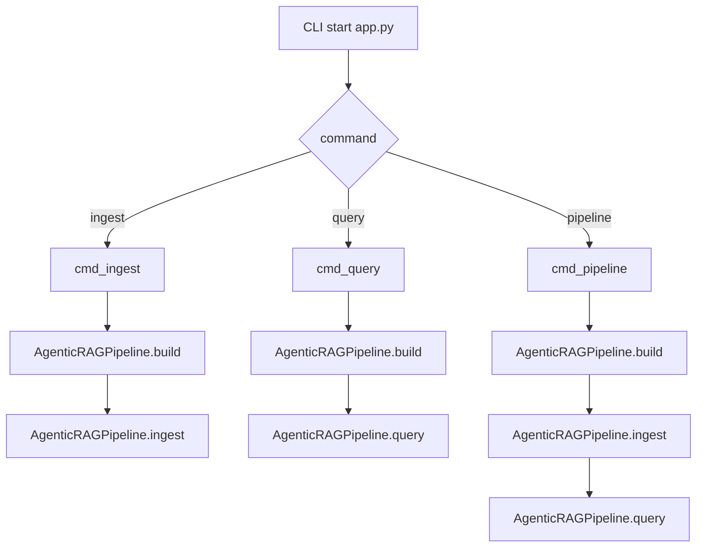
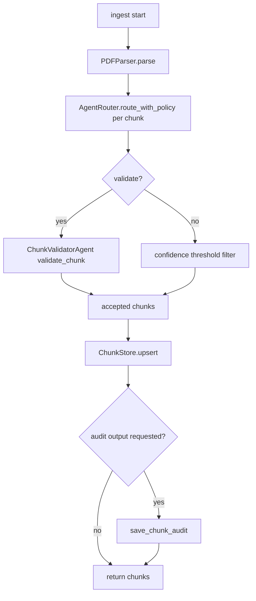
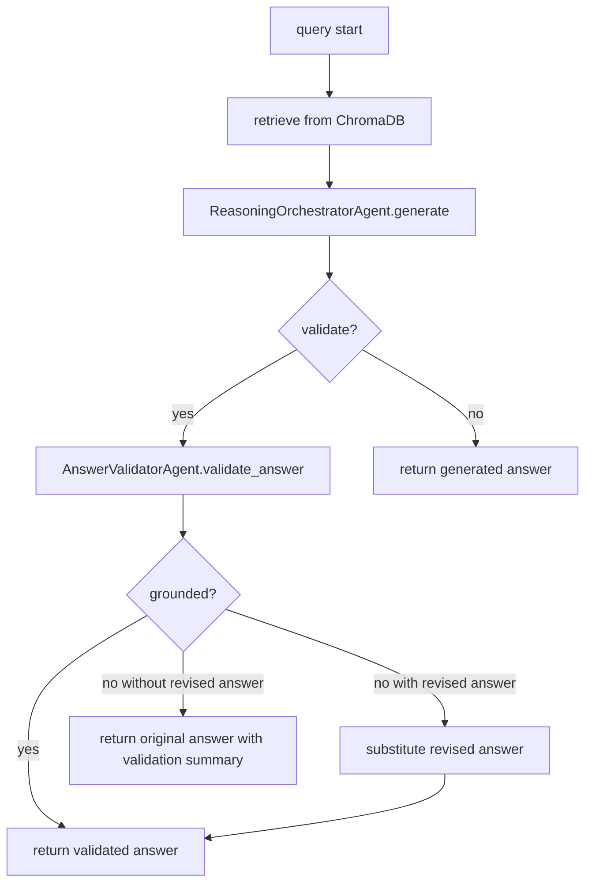
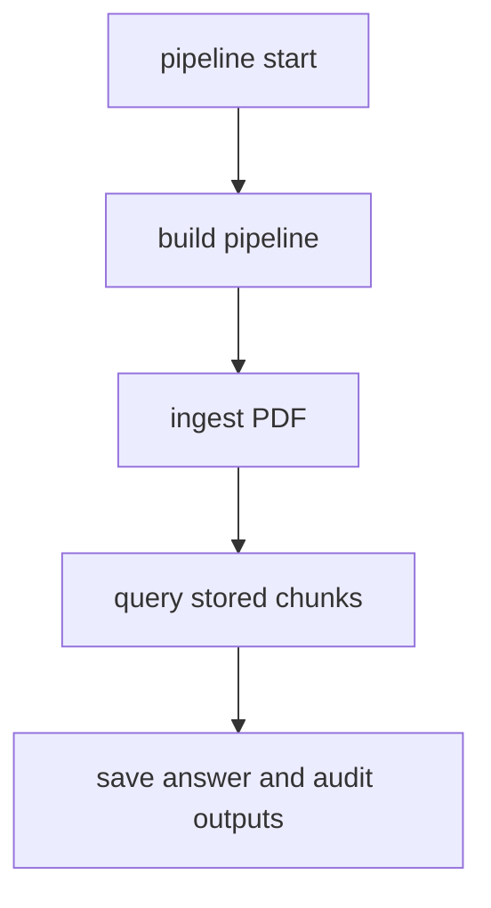

# Processing Flow

Last updated: 2026-04-04

このドキュメントは、現在サポートされている Sequential CLI flow だけを可視化します。詳細な責務は [docs/ARCHITECTURE.md](docs/ARCHITECTURE.md)、設定上の注意点は [docs/CONFIG_SETUP.md](docs/CONFIG_SETUP.md) を参照してください。

## 1. CLI dispatch

実装参照:
- `app.py`: `cmd_ingest`, `cmd_query`, `cmd_pipeline`

## 2. Ingest flow

実装参照:
- `src/core/pipeline.py`: `ingest`
- `src/core/parser.py`: `PDFParser`
- `src/agents/router.py`: `AgentRouter`

## 3. Query flow

実装参照:
- `src/core/pipeline.py`: `query`
- `src/agents/orchestrator.py`: `ReasoningOrchestratorAgent`
- `src/agents/validation.py`: `AnswerValidatorAgent`

## 4. Combined pipeline flow

実装参照:
- `app.py`: `cmd_pipeline`
- `src/core/pipeline.py`: `ingest`, `query`

## 5. Notes

- サポートされる実行モードは Sequential のみです。
- `--enable-figure-aware-fallback` は ingest 側 parser にだけ影響します。
- `--validate` は ingest では CHECKPOINT A、query では CHECKPOINT B を制御します。
- README には概要だけを残し、処理の詳細はこの文書を正とします。
