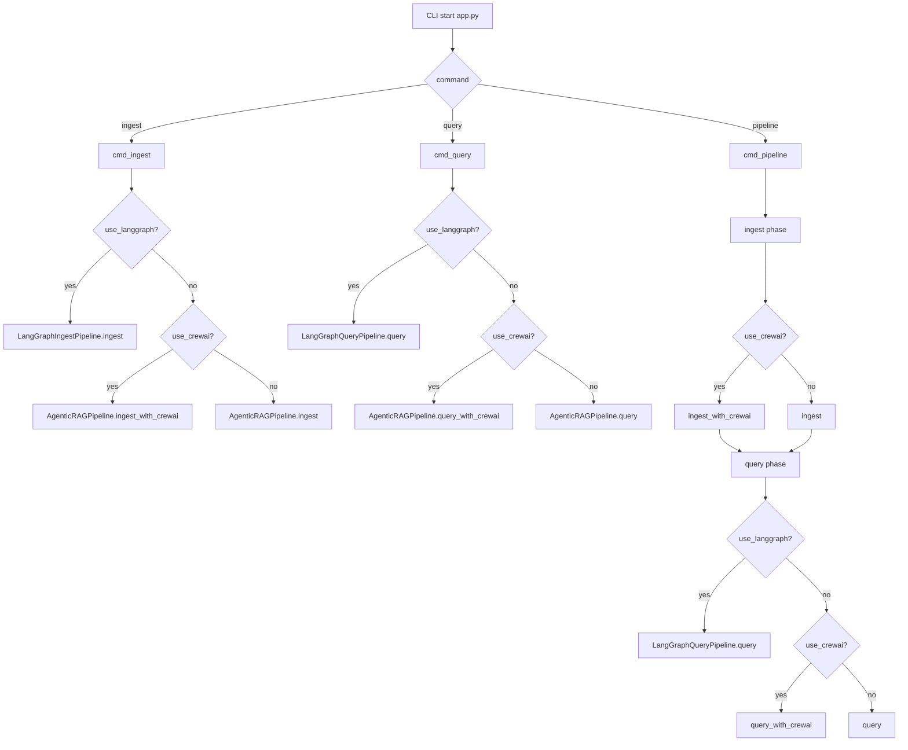
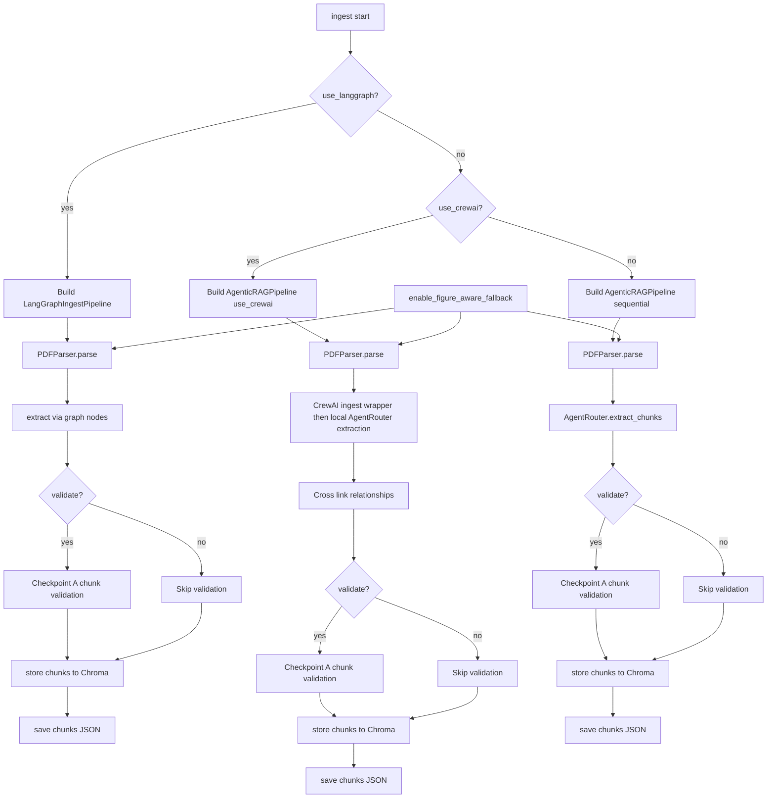
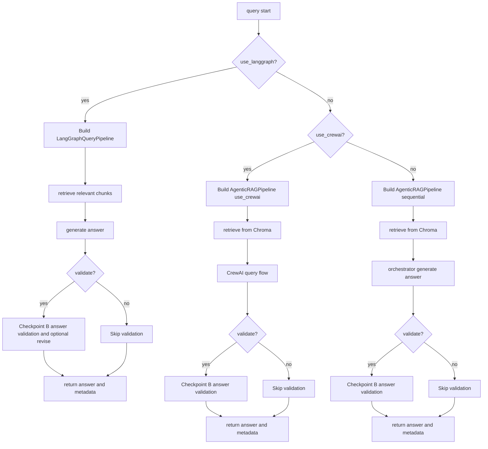
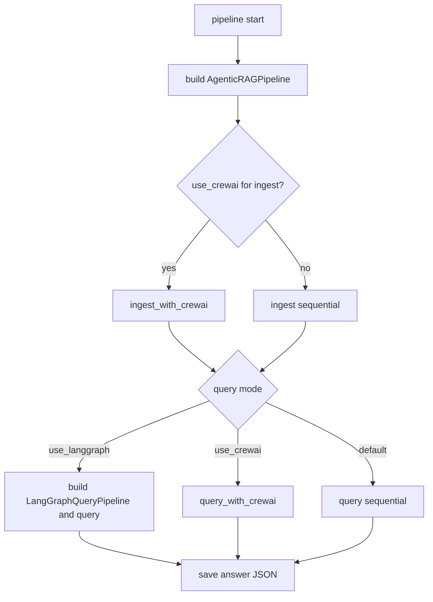
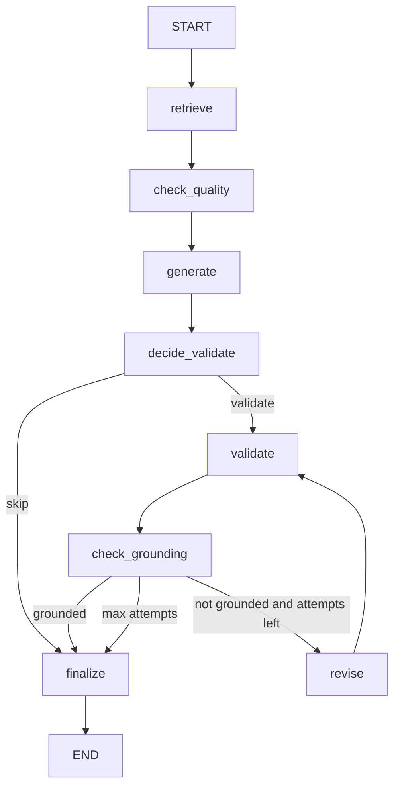

# Processing Flow (Mermaid)

Last updated: 2026-03-29

このドキュメントは、CLI 実行時の主要な分岐と処理フローを可視化したものです。実装の責務や制約は [docs/ARCHITECTURE.md](/Volumes/SSD/Programming/agentic_rag_for_multi_model_pdf_extraction/docs/ARCHITECTURE.md)、設定の注意点は [docs/CONFIG_SETUP.md](/Volumes/SSD/Programming/agentic_rag_for_multi_model_pdf_extraction/docs/CONFIG_SETUP.md) を参照してください。

## 1. CLIディスパッチ全体

実装参照:
- app.py: cmd_ingest, cmd_query, cmd_pipeline

注記:

- `pipeline` で `--use-crewai` と `--use-langgraph` を同時指定した場合、query フェーズも CrewAI が優先されます。
- `pipeline --use-langgraph` は ingest を LangGraph 化しません。

## 2. ingest 詳細フロー

実装参照:
- app.py: cmd_ingest
- src/core/pipeline.py: build, ingest, ingest_with_crewai
- src/core/crewai_pipeline.py: CrewAIIngestionPipeline.process_chunks
- src/core/langgraph_pipeline.py: LangGraphIngestPipeline.build, ingest
- src/core/parser.py: PDFParser

注記:

- CrewAI ingest の extraction は、現状では Crew task による全面抽出ではなく、`ExtractionCrew.extract_chunks()` 内で local `AgentRouter` を直接呼びます。
- CrewAI ingest の validation / linking は簡略実装を含みます。

## 3. query 詳細フロー

実装参照:
- app.py: cmd_query
- src/core/pipeline.py: query, query_with_crewai
- src/core/langgraph_pipeline.py: LangGraphQueryPipeline.query

注記:

- CrewAI query は失敗時に標準 query へフォールバックします。

## 4. pipeline 詳細フロー

実装参照:
- app.py: cmd_pipeline
- src/core/pipeline.py: ingest, ingest_with_crewai, query, query_with_crewai
- src/core/langgraph_pipeline.py: LangGraphQueryPipeline.build, query

注記:

- `pipeline` は ingest 側に LangGraph 経路を持たず、ingest は Sequential か CrewAI のどちらかです。

## 5. LangGraph query ノード遷移

実装参照:
- src/core/langgraph_pipeline.py: _build_graph, route_after_quality_check, route_after_decide_validate, route_after_grounding_check

## 更新ルール

- CLIオプションの追加や意味変更があった場合は、この文書の該当図を更新する。
- 変更対象の目安:
  - ingest分岐変更: セクション2
  - query分岐変更: セクション3
  - pipeline分岐変更: セクション4
  - LangGraphノード遷移変更: セクション5
- READMEには概要のみ残し、処理追跡の詳細は本ドキュメントを正とする。
